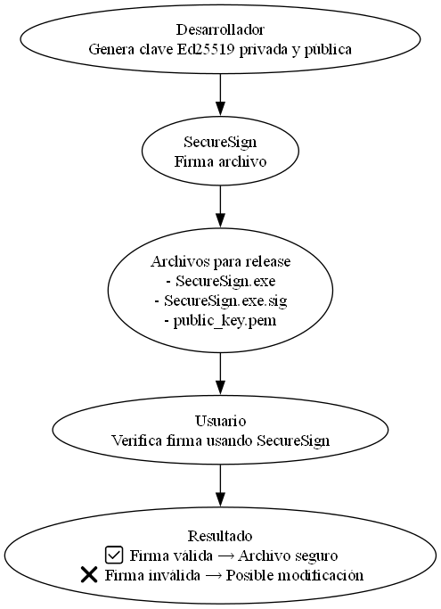

<<<<<<< HEAD
# SecureSign — Firma y verificación de ejecutables

SecureSign es una herramienta para **firmar y verificar archivos** usando Ed25519, asegurando que los ejecutables no hayan sido modificados desde que fueron firmados.

Este repositorio incluye el **ejecutable compilado para Windows**, junto con la firma y la clave pública necesarias para comprobar su autenticidad.

---

## Archivos incluidos en el release

| Archivo | Descripción |
|---------|-------------|
| `SecureSign.exe` | El ejecutable de la aplicación. |
| `SecureSign.exe.sig` | Firma digital generada con la clave privada de Ed25519. |
| `public_key.pem` | Clave pública usada para verificar la firma. |

> ⚠️ La **clave privada** nunca se comparte. Solo tú la utilizas para generar la firma.

---

## Flujo de firma y verificación

---

## Cómo verificar la firma

Descarga los tres archivos:
SecureSign.exe
SecureSign.exe.sig
public_key.pem

Abre SecureSign o cualquier herramienta compatible con Ed25519.

Selecciona en la app:
Archivo original: SecureSign.exe
Firma: SecureSign.exe.sig
Clave pública: public_key.pem

Si la firma es válida, la app mostrará un mensaje de confirmación.
Si la firma es inválida, el archivo podría haber sido modificado.

---

Buenas prácticas

Descarga siempre desde la sección oficial de Releases.
Mantén tu clave privada segura y offline.
Verifica la firma antes de ejecutar cada nuevo release del .exe.

---

Generación de la firma (para desarrolladores)
 - Abrir SecureSign
    python SecureSign.py
 - Generar par de claves Ed25519
 - Seleccionar archivo a firmar -> se generará un archivo .sig

Luego sube el .exe, la firma y la clave pública al release para que los usuarios puedan verificar la autenticidad del archivo.

---

Contacto

Juan Arnau — juan.arnau@outlook.es
Repositorio: https://github.com/juanarnau/SecureSign
=======
# SecureSign
Firmar y verificar archivos usando Ed25519
>>>>>>> 89a9b625505f7a5223e7767afe924fec122575be
